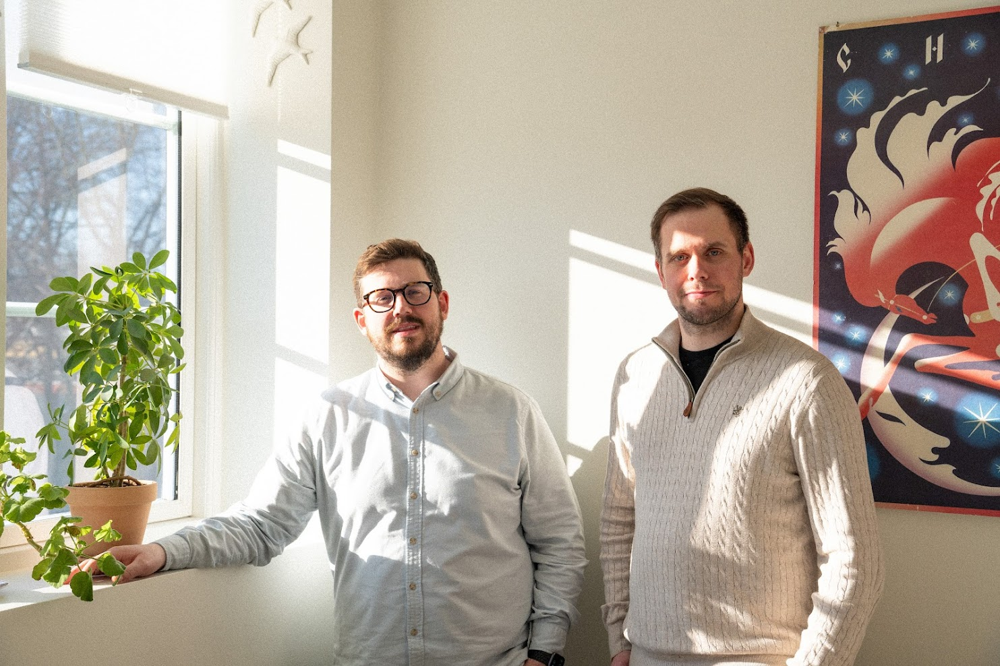
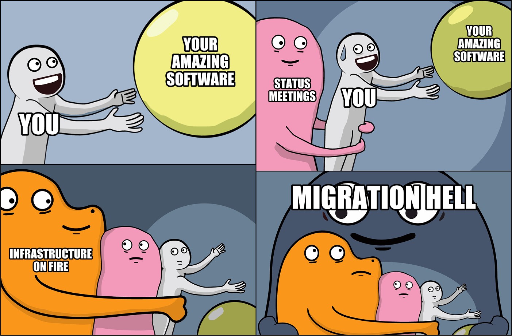

# Building great products should be simple.

**A product manager asks: "Are we shipping Friday?" The engineer answers:
"Should be good, just working through some edge cases." Meeting done in 90
seconds. Efficient, right?**

Here's what actually happened: The product manager just got a Slack message from
the CEO asking when the feature would ship. They needed a real answer but didn't
want to sound like they were micromanaging. The engineer discovered the feature
required changes to three other systems, but didn't want to sound like they were
making excuses or unable to estimate properly.

The product manager needs to understand: What's blocking this? Which
dependencies exist? What changed since yesterday? The engineer has most of the
answers in their head, but to everyone else involved, it's a scavenging hunt
across scattered across GitHub PRs, Jira tickets, Slack threads, and several
different people's mental models of how the applications intertwine. There's no
shared space – no single source of truth that both people can point to and say:
"Here's what's actually happening."

Sokkel amplifies individual efficiency and code quality when tools are connected
to internal company information, such as source code, documentation, work
tracking, and communication tools. Not (only) because AI works magic, but
because context and knowledge sharing make or break software development [^1].

Sokkel makes software development understandable to everyone who needs to
understand it. Instead of treating "applications" and "changes" as technical
concepts that live in the engineering team's tools and minds, Sokkel makes them
accessible to the whole team. An application isn't just a code base – it's a map
of dependencies, integrations and data flows. A change isn't just a Git commit –
it's an explicit connection between a user need, the business initiative to
address that need, and what was actually shipped.

Without a shared understanding, AI quickly creates a reign of chaos [^1] [^2],
and teams spend more time in unscheduled meetings [^3]. Teams who visualise and
understand the impact of changes on the system as a whole turn AI adoption into
organisational performance gains.

Making the system legible doesn't eliminate complexity, but it changes the
nature of the conversation. Instead of: "Are we still on track for Friday?"
followed by: "Yeah, should be good," you get: "I see that the payment reminder
system is done, but the accounting integration is blocked. Should we ship
without that integration?"

It's time.

[Join the waitlist](https://tally.so/r/wvKvxA) or
[subscribe to stay in the loop](https://luma.com/sokkel).

[^1]:
    [DORA | State of AI-assisted Software Development](https://dora.dev/research/2025/dora-report/)
    (2025)

[^2]:
    [Cross-functional team dynamics in technology management: a comprehensive review of efficiency and innovation enhancement](https://doi.org/10.51594/estj.v5i12.1756)
    (2024)

[^3]:
    [Understanding coordination in global software engineering: A mixed-methods study on the use of meetings and Slack](https://doi.org/10.1016/j.jss.2020.110717)
    (2025)
